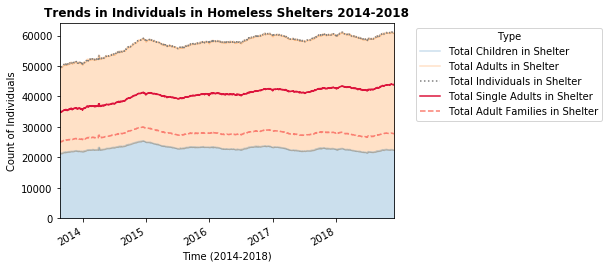

# Homework 11
## Tiffany Patafio
## December 5, 2018

Please find the updated plot for this assignment created using NYC Open Data on Homeless Shelters below. I've updated the legend and the lines to better highlight relevant points as suggested in feedback.

The above chart shows the trends in the individuals in homeless shelters between 2014 and 2018-- with data at a day level. THe homeless population in shelters is clearly increasing, but looking deeper at the shading it is broken into child vs adult individuals. You can see that the number of children has remained steady (blue) while the number of adults (orange) has increased. The lines represent two subsets of the adult population and their cumulative contribution to the total population, the individuals in adult familes (dotted, salmon) and the number of single adults (solid, crimson). Looking at these lines along with the cumulative trend, you can see that the increases in total population (marked in dotted gray line) closely mimics the shape of the line for Single Adults in Homeless shelters. In other words, the increase in Single Adults in shelters has likely driven the increase in overall individuals in homeless shelters.

Assignment 1: 

Group members: Andrea (ah4412), Tiffany (tp1600), Jerome (jl9489), and Fekade (fb1182)

For the Time Series and Decision Tree homework, the notebook is containted in this folder. I was not able to complete the homework as I struggled significantly working with the arrays and understanding the actual asks towards the end of the third question. I completed what I could but was not able to model as I could not complete the data prep work. For this assignment, I worked on my own and referred to Jerome Louison's workbook as needed for the first portion of the assignment. The team kept in close contact regarding updates and tips throughout the week.
