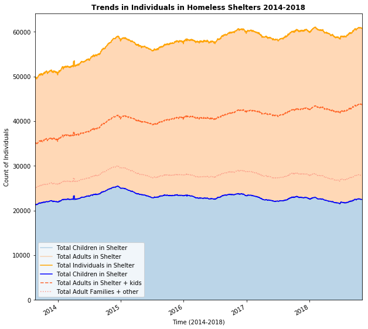

# Homework 8
## Tiffany Patafio
## November 7, 2018

Please find the plot for assignment #1 created using NYC Open Data on Homeless Shelters below. 

The above chart shows the trends in the individuals in homeless shelters between 2014 and 2018-- with data at a day level. THe homeless population in shelters is clearly increasing, but looking deeper at the colors you can see that the number of children has remained steady (blue) while the number of adults has increased. The lines represent two subsets of the adult population and their cumulative contribution to the total population, the individuals in adult familes (dotted, salmon) and the number of single adults (dashed, orangered). Looking at these lines along with the cumulative trend, you can see that the increases in total population closely mimics the shape of the line for Single Adults in Homeless shelters. In other words, the increase in Single Adults in shelters has likely driven the increase in overall individuals in homeless shelters.

Assignment 2 includes the code in the notebook attached here as well as the following Authorea summary: 
https://www.authorea.com/336160/NCKGVBeFvNjfi5ur6vMqzA
